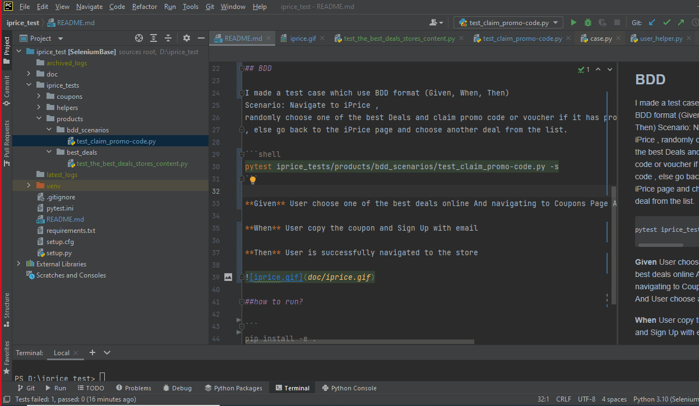

# iPrice Selenium Test 
a sample selenium project case study using iPrice product and coupon page.
this project demonstrate simple tests with certain target to validate, and also **BDD** tests with a scenario to follow. Moreover, it demonstrates how to validate http request through http status code that is useful for **API** testing and **Integration** testing

> NOTE: I noticed that the iPrice class names are **minimized** so all the css selectors I wrote is without any usage of the class 

# Tests:
### Simple tests:
1. This contains 3 test, 
    - one to count "Find the best deals" item count, 
    - test to make sure all the "Top Trending Products" has "data-vars-cgt" attribute
    - additional test as possible example tests
   
```shell
pytest iprice_tests/products/best_deals/test_the_best_deals_stores_content.py -s
```

2. Make sure the url of stores in the "Top Stores" are all active and make sure they redirect to correct page

 ```shell
pytest iprice_tests/coupons/test_urls_activation.py -s
```

### BDD

> this is an exploratory test as it choose random store and random coupon on subsequent page
> and if it couldn't find a code it will go back and try another random store

I made a test case which use BDD format (Given, When, Then)
Scenario: Navigate to iPrice ,
randomly choose one of the best Deals and claim promo code or voucher if it has promo code
, else go back to the iPrice page and choose another deal from the list. 

```shell
pytest iprice_tests/products/bdd_scenarios/test_claim_promo-code.py -s
```

**Given** User choose one of the best deals online And navigating to Coupons Page And User choose a Coupon

**When** User copy the coupon and Sign Up with email

**Then** User is successfully navigated to the store

#### how the BDD run will look like: 

this is an intersting demonstration as I show how to change tab with selenium and continue with different tab. it also change the tab back to previous tab if it couldn't find any code to copy 




## how to run?

```
# install the environment 
pip install -e . 
# execute any test with targeting the file 
pytest path-to-file/filename.py
```
